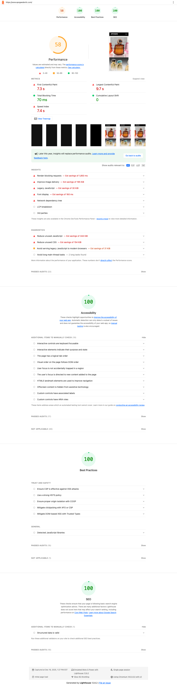

# Apogee Dev LLC - Site Performance Audit

**For:** Rob Lynch | **Date:** Dec 16, 2025 | **Site:** apogeedevllc.com

---

## What I Found

I ran Google's Lighthouse test on your site—the same test Google uses when deciding search rankings. Here's what came up:

### Desktop Test: 95/100 ✅

**Loads fast (1.2 seconds). Looking good.**

---

### Mobile Test (Slow 4G): 57/100 ⚠️

**Takes longer (9.7 seconds) in Google's worst-case scenario.**

---

## Here's What's Happening

**The good news:**
- Your site loads fast on desktop (1.2 seconds) ✅
- It also loads fast on modern phones—I tested it on mine with cellular and it took about a second ✅
- Everything else checks out perfectly: search optimization, accessibility, and security all score 100/100 ✅

**The challenge:**
- Google tests using a slow 4G simulation (worst-case scenario)
- In that test, your site scores 57/100
- **This can affect where you show up in mobile search results**—even though most visitors experience fast load times
- Competitors scoring 90+ might rank higher when people search on their phones

---

## What We Can Fix

| What I'd Do | How It Helps |
|-----|--------|
| **Turn on file compression** | Saves 123KB on every page load—that's 83% smaller |
| Let non-essential files load after the page appears | Saves 1.85 seconds |
| Remove code your site doesn't use (344 KB) | Saves 1.50 seconds |
| Remove styles your site doesn't use (154 KB) | Saves 0.85 seconds |
| Show text right away while custom fonts load | Saves 0.15 seconds |

**The result:** Your mobile score goes from 57 to somewhere around 85-90/100.

**Time investment:** We can handle all of this in a 4-hour block.

---

## What I'd Recommend

**If search rankings matter to your business:** Let's tackle these fixes. Four hours gets your Google mobile score from 57 to 85-90. The biggest win is turning on file compression—it saves 123KB every time someone visits your site.

**If most clients find you through referrals or ads:** Your site performs well in real-world situations. The Google test result might not impact your business much. This can wait.

Whatever makes sense for Apogee works for me.

---

**Full reports:** [Desktop](apogee-desktop-report) | [Mobile](apogee-audit.report.html)
